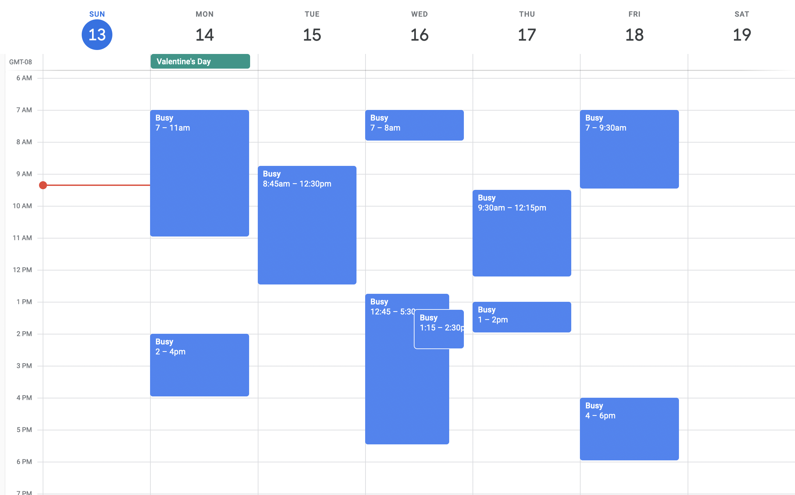
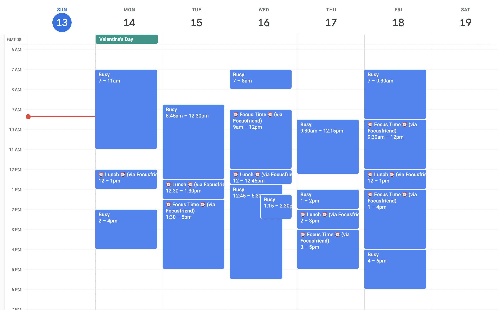

# ⏰ Focusfriend

Focusfriend is a small [Google Apps Script](https://www.google.com/script/start/) utility that clones a subset of [Clockwise](https://www.getclockwise.com/)'s functionality.

Today, its only feature is to automatically schedule focus time blocks during sufficiently long gaps in your calendar.

## Usage

This project uses [clasp](https://developers.google.com/apps-script/guides/clasp) to manage Apps Script code.

After installing clasp, log in:

``` sh
clasp login # go through login flow
```

Then, you can create the project:

``` sh
clasp create --title "Focusfriend" --type sheets
```

The sheet that was created will hold the settings. You can paste the below settings in the sheet, tweaking the workday start and end times to match your work schedule.

``` sh
clasp open --addon
```

```
Setting Key	Setting Value
workday_start_hour	9:00 AM
workday_end_hour	6:00 PM
```

Push the Apps Script code to the Sheets Add-on script:

``` sh
clasp push
```

Then open the Apps Script UI to test the script and grant permissions (the entrypoint is `scheduleFocusTime`), and to set up a time-based trigger:

``` sh
clasp open
```




